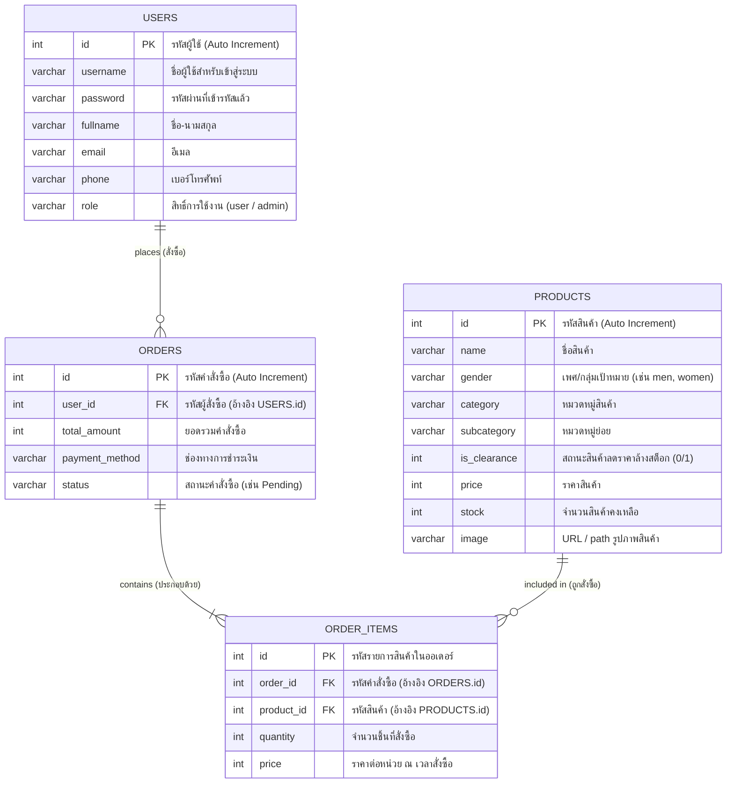

# 📊 Entity-Relationship Diagram (ER Diagram) - Clothing Store

เอกสารอธิบายโครงสร้างฐานข้อมูลและความสัมพันธ์ของตาราง (ER Diagram) สำหรับระบบ **Clothing Store**

---

## 1. Mermaid ER Diagram



---

## 2. พจนานุกรมข้อมูล (Data Dictionary)

### 2.1 ตาราง `users` (ข้อมูลผู้ใช้งาน)
| ชื่อคอลัมน์ | ประเภทข้อมูล | ค่าว่าง (Null) | คีย์ | ค่าเริ่มต้น | คำอธิบาย |
| :--- | :--- | :---: | :---: | :--- | :--- |
| `id` | INT(11) | NO | PK | Auto Increment | รหัสประจำตัวผู้ใช้ |
| `username` | VARCHAR(50) | NO | | | ชื่อผู้ใช้สำหรับล็อกอิน |
| `password` | VARCHAR(255) | NO | | | รหัสผ่าน (Hash) |
| `fullname` | VARCHAR(100) | NO | | | ชื่อ - นามสกุล |
| `email` | VARCHAR(100) | NO | | | อีเมล |
| `phone` | VARCHAR(20) | YES | | NULL | เบอร์โทรศัพท์ |
| `role` | VARCHAR(20) | YES | | 'user' | สิทธิ์ผู้ใช้ (`user`, `admin`) |

---

### 2.2 ตาราง `products` (ข้อมูลสินค้าในสต็อก)
| ชื่อคอลัมน์ | ประเภทข้อมูล | ค่าว่าง (Null) | คีย์ | ค่าเริ่มต้น | คำอธิบาย |
| :--- | :--- | :---: | :---: | :--- | :--- |
| `id` | INT(11) | NO | PK | Auto Increment | รหัสสินค้า |
| `name` | VARCHAR(100) | NO | | | ชื่อสินค้า |
| `gender` | VARCHAR(20) | NO | | | เพศ/กลุ่มเป้าหมาย (`men`, `women`, `unisex`) |
| `category` | VARCHAR(50) | NO | | | หมวดหมู่หลัก (`men`, `women`, `clearance`) |
| `subcategory` | VARCHAR(50) | YES | | NULL | หมวดหมู่ย่อย (เช่น `shirts`, `bottoms`) |
| `is_clearance` | INT(11) | YES | | 0 | สินค้าลดราคาล้างสต็อก (0 = ปกติ, 1 = Clearance) |
| `price` | INT(11) | NO | | | ราคาสินค้า (บาท) |
| `stock` | INT(11) | NO | | | จำนวนสินค้าคงเหลือ |
| `image` | VARCHAR(255) | YES | | NULL | ที่อยู่ URL หรือพาธรูปภาพ |

---

### 2.3 ตาราง `orders` (ข้อมูลคำสั่งซื้อ)
| ชื่อคอลัมน์ | ประเภทข้อมูล | ค่าว่าง (Null) | คีย์ | ค่าเริ่มต้น | คำอธิบาย |
| :--- | :--- | :---: | :---: | :--- | :--- |
| `id` | INT(11) | NO | PK | Auto Increment | รหัสคำสั่งซื้อ |
| `user_id` | INT(11) | NO | FK | | รหัสผู้สั่งซื้อ (อ้างอิง `users.id`) |
| `total_amount` | INT(11) | NO | | | ยอดรวมเงินสุทธิ |
| `payment_method` | VARCHAR(50) | YES | | NULL | ช่องทางชำระเงิน (เช่น โอนเงิน, บัตรเครดิต) |
| `status` | VARCHAR(50) | YES | | 'Pending' | สถานะคำสั่งซื้อ (`Pending`, `Paid`, `Shipped`, etc.) |

---

### 2.4 ตาราง `order_items` (รายการสินค้าในแต่ละคำสั่งซื้อ)
| ชื่อคอลัมน์ | ประเภทข้อมูล | ค่าว่าง (Null) | คีย์ | ค่าเริ่มต้น | คำอธิบาย |
| :--- | :--- | :---: | :---: | :--- | :--- |
| `id` | INT(11) | NO | PK | Auto Increment | รหัสรายการสั่งซื้อ |
| `order_id` | INT(11) | NO | FK | | รหัสคำสั่งซื้อ (อ้างอิง `orders.id`) |
| `product_id` | INT(11) | NO | FK | | รหัสสินค้า (อ้างอิง `products.id`) |
| `quantity` | INT(11) | NO | | | จำนวนสินค้าที่สั่ง |
| `price` | INT(11) | NO | | | ราคาต่อหน่วย ณ วันสั่งซื้อ |

---

## 3. ความสัมพันธ์ระหว่างตาราง (Relationships)

1. **`users` (1) ──── (N) `orders`**
   - ผู้ใช้งาน 1 บัญชี สามารถทำการสั่งซื้อได้หลายคำสั่งซื้อ (`user_id` ใน `orders` ชี้ไปยัง `id` ของ `users`)
2. **`orders` (1) ──── (N) `order_items`**
   - คำสั่งซื้อ 1 รายการ ประกอบไปด้วยรายการสินค้า 1 หรือหลายรายการ (`order_id` ใน `order_items` ชี้ไปยัง `id` ของ `orders`)
3. **`products` (1) ──── (N) `order_items`**
   - สินค้า 1 ชิ้น สามารถถูกนำไปสร้างเป็นรายการสั่งซื้อในหลายคำสั่งซื้อ (`product_id` ใน `order_items` ชี้ไปยัง `id` ของ `products`)

---

## 4. โครงสร้าง SQL (DDL Script)

```sql
CREATE DATABASE IF NOT EXISTS `clothing_store` DEFAULT CHARACTER SET utf8mb4 COLLATE utf8mb4_general_ci;
USE `clothing_store`;

-- ตารางผู้ใช้งาน
CREATE TABLE IF NOT EXISTS `users` (
  `id` INT(11) NOT NULL AUTO_INCREMENT,
  `username` VARCHAR(50) NOT NULL,
  `password` VARCHAR(255) NOT NULL,
  `fullname` VARCHAR(100) NOT NULL,
  `email` VARCHAR(100) NOT NULL,
  `phone` VARCHAR(20) DEFAULT NULL,
  `role` VARCHAR(20) DEFAULT 'user',
  PRIMARY KEY (`id`)
) ENGINE=InnoDB DEFAULT CHARSET=utf8mb4 COLLATE=utf8mb4_general_ci;

-- ตารางสินค้า
CREATE TABLE IF NOT EXISTS `products` (
  `id` INT(11) NOT NULL AUTO_INCREMENT,
  `name` VARCHAR(100) NOT NULL,
  `gender` VARCHAR(20) NOT NULL,
  `category` VARCHAR(50) NOT NULL,
  `subcategory` VARCHAR(50) DEFAULT NULL,
  `is_clearance` INT(11) DEFAULT 0,
  `price` INT(11) NOT NULL,
  `stock` INT(11) NOT NULL,
  `image` VARCHAR(255) DEFAULT NULL,
  PRIMARY KEY (`id`)
) ENGINE=InnoDB DEFAULT CHARSET=utf8mb4 COLLATE=utf8mb4_general_ci;

-- ตารางคำสั่งซื้อ
CREATE TABLE IF NOT EXISTS `orders` (
  `id` INT(11) NOT NULL AUTO_INCREMENT,
  `user_id` INT(11) NOT NULL,
  `total_amount` INT(11) NOT NULL,
  `payment_method` VARCHAR(50) DEFAULT NULL,
  `status` VARCHAR(50) DEFAULT 'Pending',
  PRIMARY KEY (`id`),
  CONSTRAINT `fk_orders_user` FOREIGN KEY (`user_id`) REFERENCES `users` (`id`) ON DELETE CASCADE
) ENGINE=InnoDB DEFAULT CHARSET=utf8mb4 COLLATE=utf8mb4_general_ci;

-- ตารางรายการสินค้าในคำสั่งซื้อ
CREATE TABLE IF NOT EXISTS `order_items` (
  `id` INT(11) NOT NULL AUTO_INCREMENT,
  `order_id` INT(11) NOT NULL,
  `product_id` INT(11) NOT NULL,
  `quantity` INT(11) NOT NULL,
  `price` INT(11) NOT NULL,
  PRIMARY KEY (`id`),
  CONSTRAINT `fk_order_items_order` FOREIGN KEY (`order_id`) REFERENCES `orders` (`id`) ON DELETE CASCADE,
  CONSTRAINT `fk_order_items_product` FOREIGN KEY (`product_id`) REFERENCES `products` (`id`) ON DELETE CASCADE
) ENGINE=InnoDB DEFAULT CHARSET=utf8mb4 COLLATE=utf8mb4_general_ci;
```
