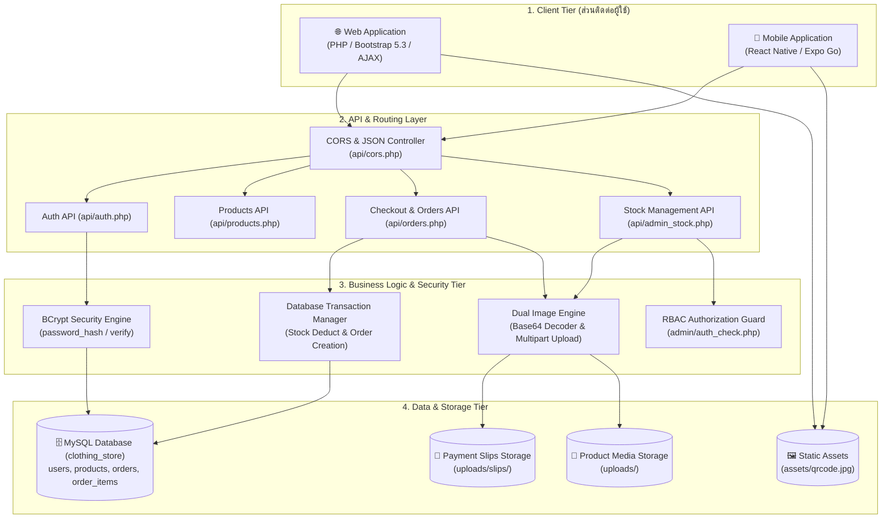
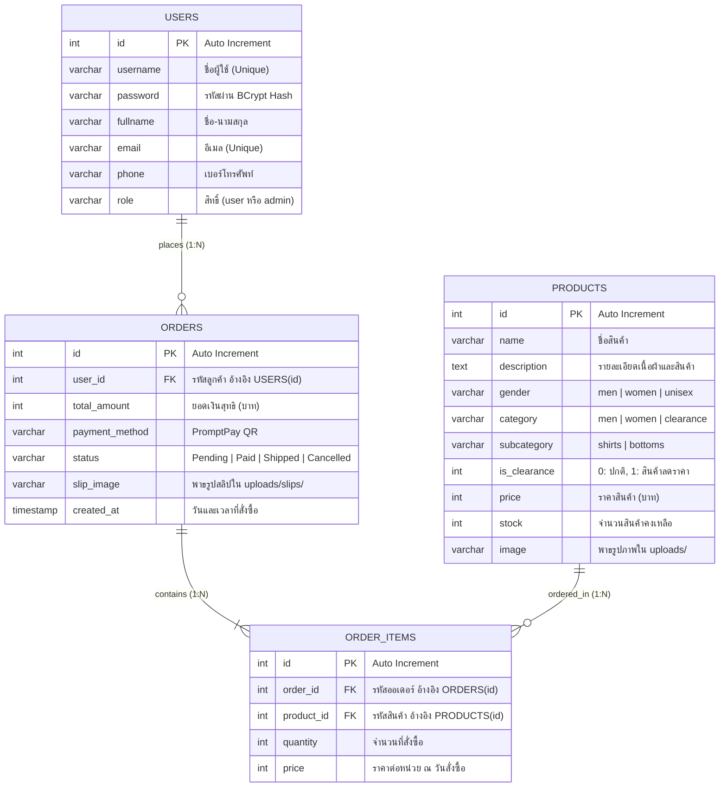
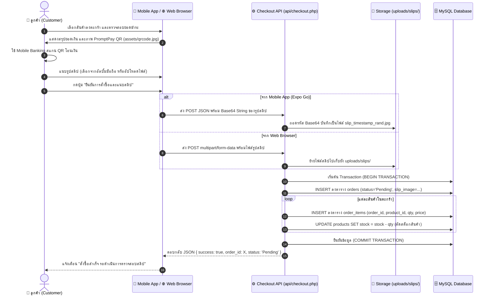
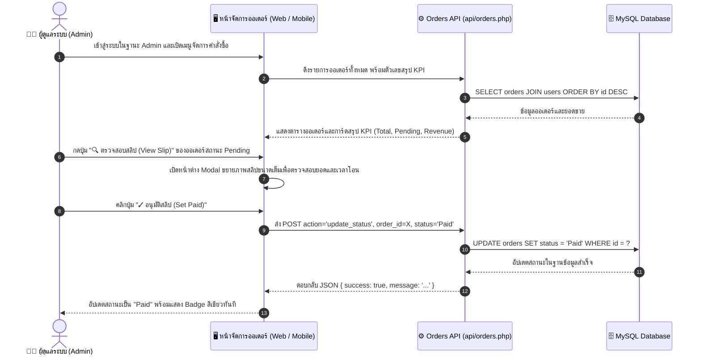
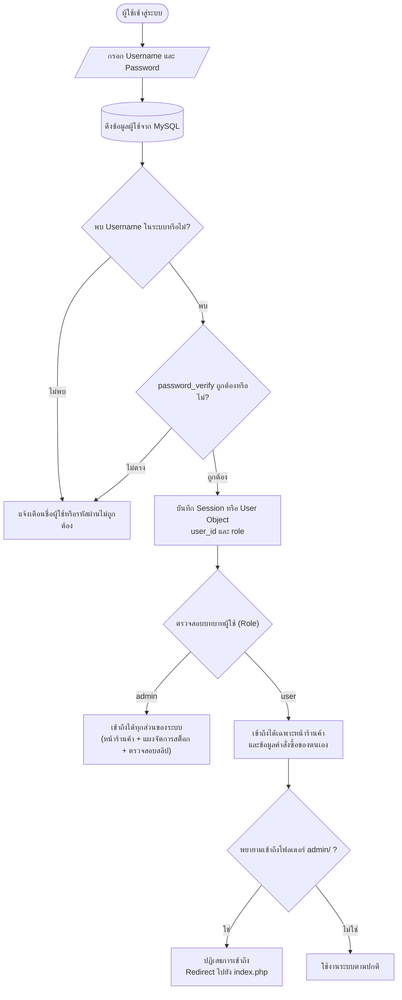

# 🛍️ Clothing Store E-Commerce & Mobile App (Term Project 2026)

ระบบร้านค้าเสื้อผ้าออนไลน์แบบครบวงจรระดับองค์กร (Omnichannel Full-Stack E-Commerce System) รองรับการทำงานทั้งบน **เว็บแอปพลิเคชัน (Web Application)** และ **แอปพลิเคชันมือถือ (Mobile App บน Expo Go)** โดยทำงานประสานกันผ่าน **REST API** ฐานข้อมูล **MySQL** เดียวกันแบบ Real-time พร้อมระบบชำระเงิน **PromptPay QR Code + แนบสลิป**, ระบบแอดมินตรวจสลิปและอนุมัติสถานะ, และระบบความปลอดภัยมาตรฐานเว็บสากล

---

## 📑 สารบัญ (Table of Contents)
1. [ภาพรวมของโครงการ (Project Overview)](#-ภาพรวมของโครงการ-project-overview)
2. [สถาปัตยกรรมระบบแบบผสมผสาน (Full-Stack Architecture)](#-สถาปัตยกรรมระบบแบบผสมผสาน-full-stack-architecture)
3. [โครงสร้างฐานข้อมูล (Database Schema & ER Diagram)](#-โครงสร้างฐานข้อมูล-database-schema--er-diagram)
4. [ผังการทำงานของระบบ (System Workflows)](#-ผังการทำงานของระบบ-system-workflows)
   - [4.1 ผังการสั่งซื้อและชำระเงิน (Checkout & Slip Upload Flow)](#41-ผังการสั่งซื้อและชำระเงิน-checkout--slip-upload-flow)
   - [4.2 ผังการตรวจสอบและอนุมัติสลิปของแอดมิน (Admin Slip Verification Flow)](#42-ผังการตรวจสอบและอนุมัติสลิปของแอดมิน-admin-slip-verification-flow)
   - [4.3 ผังการยืนยันตัวตนและสิทธิ์การเข้าใช้งาน (Authentication & RBAC Flow)](#43-ผังการยืนยันตัวตนและสิทธิ์การเข้าใช้งาน-authentication--rbac-flow)
5. [ตารางเปรียบเทียบฟังก์ชันการทำงาน (Feature Parity: Web vs Mobile)](#-ตารางเปรียบเทียบฟังก์ชันการทำงาน-feature-parity-web-vs-mobile)
6. [โครงสร้างไดเรกทอรี (Directory Structure)](#-โครงสร้างไดเรกทอรี-directory-structure)
7. [มาตรฐานความปลอดภัยของระบบ (Security Standards)](#-มาตรฐานความปลอดภัยของระบบ-security-standards)
8. [คู่มือการติดตั้งและเปิดใช้งาน (Setup & Installation Guide)](#-คู่มือการติดตั้งและเปิดใช้งาน-setup--installation-guide)
   - [8.1 การติดตั้งและรัน Web Application (XAMPP)](#81-การติดตั้งและรัน-web-application-xampp)
   - [8.2 การรัน Mobile App บนสมาร์ตโฟนผ่าน Expo Go](#82-การรัน-mobile-app-บนสมาร์ตโฟนผ่าน-expo-go)
9. [บัญชีผู้ใช้งานสำหรับทดสอบระบบ (Test Accounts)](#-บัญชีผู้ใช้งานสำหรับทดสอบระบบ-test-accounts)

---

## 🌟 ภาพรวมของโครงการ (Project Overview)

โครงการนี้ได้รับการออกแบบและพัฒนาขึ้นภายใต้แนวคิด **Omnichannel Architecture** ที่เชื่อมโยงการซื้อขายเสื้อผ้าระหว่างหน้าเว็บและแอปพลิเคชันมือถือเข้าด้วยกันอย่างไร้รอยต่อ:

- **Web Application**: พัฒนาด้วย **PHP 8.2 + MySQL**, หน้าบ้านตกแต่งด้วยธีม **Wireframe Minimalist Boutique** ผสมผสาน **Bootstrap 5.3** และ **AJAX Engine** รองรับ Responsive ทุกหน้าจอ
- **Mobile Application**: พัฒนาด้วย **React Native + Expo SDK** รองรับการทดสอบสดบนสมาร์ตโฟนจริงผ่านแอป **Expo Go** (ทั้ง iOS และ Android) มีดีไซน์และฟังก์ชันเทียบเท่าหน้าเว็บ 1:1
- **Unified Backend & REST API**: ฝั่งหลังบ้านใช้ฐานข้อมูล **MySQL** เดียวกัน ให้บริการผ่าน **REST API JSON** รองรับทั้งการส่งข้อมูลแบบ JSON, Base64 Image Processing และ Multipart File Upload

---

## 🏛️ สถาปัตยกรรมระบบแบบผสมผสาน (Full-Stack Architecture)

ระบบแยกสถาปัตยกรรมออกเป็น 4 ระดับ (4-Tier Architecture) เพื่อความยืดหยุ่น ความปลอดภัย และประสิทธิภาพสูงสุด:



---

## 🗄️ โครงสร้างฐานข้อมูล (Database Schema & ER Diagram)

ฐานข้อมูลใช้ชื่อ `clothing_store` มีเอนทิตีที่สัมพันธ์กันทั้งหมด 4 ตาราง พร้อมข้อกำหนด Referential Integrity (Foreign Keys แบบ `ON DELETE CASCADE`)



---

## 🔄 ผังการทำงานของระบบ (System Workflows)

### 4.1 ผังการสั่งซื้อและชำระเงิน (Checkout & Slip Upload Flow)
รองรับการสั่งซื้อผ่านทั้ง **เว็บ** (Multipart Upload) และ **มือถือ** (Base64 JSON Upload) พร้อมกัน



---

### 4.2 ผังการตรวจสอบและอนุมัติสลิปของแอดมิน (Admin Slip Verification Flow)



---

### 4.3 ผังการยืนยันตัวตนและสิทธิ์การเข้าใช้งาน (Authentication & RBAC Flow)



---

## 📊 ตารางเปรียบเทียบฟังก์ชันการทำงาน (Feature Parity: Web vs Mobile)

| ฟังก์ชันการทำงาน (Features) | Web Application | Mobile App (Expo Go) | รายละเอียดทางเทคนิค |
| :--- | :---: | :---: | :--- |
| **แคตตาล็อกสินค้า (Product Catalog)** | ✅ | ✅ | แสดงสินค้าแบบ Grid พร้อม Badge หมวดหมู่ |
| **ค้นหาตามคีย์เวิร์ด (Live Search)** | ✅ | ✅ | ค้นหาจากชื่อสินค้าและคำบรรยาย |
| **ตัวกรองประเภทย่อย (Subcategory)** | ✅ | ✅ | แยกดูเฉพาะเสื้อ (`Shirts`) หรือกางเกง (`Bottoms`) |
| **ตัวกรองช่วงราคา (Price Range)** | ✅ | ✅ | กำหนดราคาต่ำสุด (Min) และราคาสูงสุด (Max) |
| **จัดเรียงสินค้า (Sorting)** | ✅ | ✅ | ล่าสุด, ราคาต่ำ-สูง, ราคาสูง-ต่ำ, ชื่อ A-Z |
| **หน้ารายละเอียดสินค้า (Product Details)** | ✅ | ✅ | เลือกไซส์ S, M, L, XL, 2XL และปรับจำนวน |
| **ตารางเทียบขนาด (Size Guide Table)** | ✅ | ✅ | ตารางระบุขนาด อก, ยาว, ไหล่ ครบทุกขนาด |
| **สินค้าที่เกี่ยวข้อง (Related Products)** | ✅ | ✅ | แนะนำสินค้าหมวดหมู่เดียวกันด้านล่าง |
| **ชำระเงินด้วย PromptPay QR Code** | ✅ | ✅ | ชำระเงินวิธีเดียวผ่านภาพ QR Code พร้อมเพย์ |
| **แนบสลิปการโอนเงิน (Slip Upload)** | ✅ | ✅ | เว็บอัปโหลดไฟล์ / มือถือเลือกรูปจากอัลบั้ม (`base64: true`) |
| **ใบเสร็จรับเงิน (Invoice & Receipt)** | ✅ | ✅ | แสดงรายละเอียดคำสั่งซื้อ, ยอดเงิน, รูปสลิปที่แนบ |
| **แก้ไขข้อมูลส่วนตัว (Edit Profile)** | ✅ | ✅ | เปลี่ยนชื่อ-นามสกุล, อีเมล, และเบอร์โทรศัพท์ |
| **เปลี่ยนรหัสผ่าน (Change Password)** | ✅ | ✅ | ตรวจสอบรหัสเดิมและเข้ารหัสรหัสใหม่ด้วย BCrypt |
| **แอดมิน: การ์ดสรุป KPI ยอดขาย** | ✅ | ✅ | ยอดขายสุทธิ, ออเดอร์ทั้งหมด, ออเดอร์รอตรวจ |
| **แอดมิน: ตรวจสอบสลิปขยายเต็ม** | ✅ | ✅ | หน้าต่าง Modal ขยายภาพสลิปความละเอียดสูง |
| **แอดมิน: อนุมัติสลิปเปลี่ยนเป็น Paid** | ✅ | ✅ | ปุ่มกดอนุมัติใน 1 คลิก พร้อมอัปเดตสถานะทันที |
| **แอดมิน: บริหารจัดการสต็อกสินค้า** | ✅ | ✅ | ปรับจำนวนสต็อก (+/-), เพิ่มสินค้าใหม่, ลบสินค้า |

---

## 📂 โครงสร้างไดเรกทอรี (Directory Structure)

```plaintext
clothing_store/
├── admin/                           # ระบบหลังบ้านฝั่งเว็บ (Web Backoffice - Admin Only)
│   ├── auth_check.php               # Middleware ตรวจสอบสิทธิ์ผู้ดูแลระบบ (RBAC)
│   ├── manage_orders.php            # แดชบอร์ดจัดการคำสั่งซื้อ ตรวจสอบสลิป และอนุมัติสถานะ
│   └── manage_stock.php             # จัดการสต็อกสินค้า (เพิ่ม ลบ แก้ไข อัปโหลดรูป)
├── api/                             # REST API Endpoints สำหรับ Mobile App และ External Clients
│   ├── cors.php                     # Centralized CORS Header และฟังก์ชัน JSON Response
│   ├── auth.php                     # API เข้าสู่ระบบ, สมัครสมาชิก, แก้ไขโปรไฟล์, เปลี่ยนรหัสผ่าน
│   ├── products.php                 # API รายการสินค้า, ค้นหา, กรองช่วงราคา, เรียงลำดับ, รายละเอียด
│   ├── checkout.php                 # API สั่งซื้อสินค้า ตัดสต็อก และบันทึกสลิป (Base64 & Multipart)
│   ├── orders.php                   # API ประวัติออเดอร์ลูกค้า, รายการออเดอร์แอดมิน, ปรับสถานะ Paid
│   └── admin_stock.php              # API บริหารจัดการสต็อกสินค้า เพิ่ม/แก้ไข/ลบ และสถิติ
├── assets/                          # ไฟล์ทรัพยากรคงที่
│   └── qrcode.jpg                   # ภาพ PromptPay QR Code สำหรับรับชำระเงิน
├── config/
│   └── db.php                       # ไฟล์เชื่อมต่อฐานข้อมูล MySQLi รวมศูนย์
├── includes/                        # Layout ส่วนกลางของหน้าเว็บ (Navbar, Footer, Toast UI)
│   ├── header.php
│   └── footer.php
├── mobile/                          # แอปพลิเคชันมือถือ (React Native + Expo SDK)
│   ├── App.js                       # Entry Point หลักของแอปมือถือ
│   ├── app.json                     # การตั้งค่าแอป Expo
│   ├── package.json                 # Dependencies ของแอปมือถือ
│   └── src/
│       ├── config.js                # กำหนดค่า Server IP (`192.168.1.141`) สำหรับเชื่อมต่อ XAMPP
│       ├── theme.js                 # Design Tokens ชุดสี Wireframe ถอดแบบจากหน้าเว็บ
│       ├── services/
│       │   └── api.js               # Service เรียกใช้งาน REST API Backend ครบทุก Endpoint
│       └── components/
│           ├── ProductCard.js       # การ์ดสินค้าสไตล์ไวร์เฟรมมินิมอล
│           ├── ProductDetailModal.js# หน้ารายละเอียดสินค้า, ไซส์, ตารางไซส์, สินค้าที่เกี่ยวข้อง
│           ├── CartModal.js         # ตะกร้าสินค้า, สแกน QR, เลือกรูปสลิปจากอัลบั้มมือถือ
│           ├── OrdersModal.js       # ประวัติการสั่งซื้อของลูกค้า
│           ├── OrderDetailModal.js  # ใบเสร็จรับเงินฉบับเต็ม และปุ่มอนุมัติสำหรับแอดมิน
│           ├── ProfileModal.js      # หน้าข้อมูลส่วนตัว, แก้ไขโปรไฟล์, เปลี่ยนรหัสผ่าน
│           ├── FilterModal.js       # หน้าต่างตัวกรองขั้นสูง (Subcategory, Price, Sort)
│           ├── AdminOrdersModal.js  # แผงจัดการออเดอร์และตรวจสลิปสำหรับแอดมิน
│           └── AdminStockModal.js   # แผงจัดการสต็อกสินค้า ปรับสต็อกด่วน และเพิ่มสินค้าใหม่
├── uploads/                         # โฟลเดอร์จัดเก็บไฟล์ภาพที่อัปโหลดเข้าสู่ระบบ
│   ├── .gitkeep
│   └── slips/                       # โฟลเดอร์เก็บรูปสลิปโอนเงินของลูกค้า
│       └── .gitkeep
├── index.php                        # หน้าแรกของเว็บ (Hero Section & Featured Products)
├── products.php                     # หน้ารวมสินค้าฝั่งเว็บ พร้อมแถบค้นหาและตัวกรอง
├── product_detail.php               # หน้ารายละเอียดสินค้าฝั่งเว็บ พร้อมตารางไซส์
├── cart.php                         # ตะกร้าสินค้าฝั่งเว็บ สแกน QR และฟอร์มแนบสลิป
├── order_detail.php                 # หน้ารายละเอียดคำสั่งซื้อและพิมพ์ใบเสร็จ (Print Invoice)
├── profile.php                      # หน้าโปรไฟล์และประวัติคำสั่งซื้อฝั่งเว็บ
├── edit_profile.php                 # หน้าแก้ไขข้อมูลส่วนตัวฝั่งเว็บ
├── change_password.php              # หน้าเปลี่ยนรหัสผ่านฝั่งเว็บ
├── login.php                        # หน้าเข้าสู่ระบบฝั่งเว็บ
├── register.php                     # หน้าลงทะเบียนผู้ใช้ฝั่งเว็บ
├── logout.php                       # หน้าออกจากระบบ
├── ER_DIAGRAM.md                    # เอกสารรายละเอียดโครงสร้างฐานข้อมูลและ DDL
├── README.md                        # เอกสารภาพรวมและคู่มือระบบ (Master Documentation)
└── .gitignore                       # ละเว้นโฟลเดอร์ node_modules และไฟล์ชั่วคราว
```

---

## 🔒 มาตรฐานความปลอดภัยของระบบ (Security Standards)

1. **การป้องกัน SQL Injection 100%**:
   - ทุกคำสั่ง SQL ทั้งในฝั่งเว็บและใน REST API ที่รับค่าจากผู้ใช้ จะต้องทำงานผ่าน **Prepared Statements (`mysqli_stmt`)** และทำการผูกพารามิเตอร์ (Parameter Binding) เสมอ
2. **การเข้ารหัสผ่านแบบ One-Way Hash (BCrypt)**:
   - รหัสผ่านผู้ใช้งานไม่มีการเก็บเป็น Plain Text ในฐานข้อมูล โดยจะถูกแฮชผ่าน `password_hash($pass, PASSWORD_BCRYPT)` และตรวจสอบด้วย `password_verify()`
3. **การควบคุมสิทธิ์ตามบทบาท (Role-Based Access Control - RBAC)**:
   - ตรวจสอบสิทธิ์สองชั้น: ฝั่งเว็บใช้ Middleware [`admin/auth_check.php`](file:///D:/Xamp/htdocs/clothing_store/admin/auth_check.php) ป้องกันการเข้าถึงไฟล์โดยไม่ได้รับอนุญาต และฝั่ง API ตรวจสอบสิทธิ์ก่อนอนุญาตให้เรียกฟังก์ชันผู้ดูแลระบบ
4. **ความปลอดภัยในการอัปโหลดไฟล์ภาพและสลิป (File Security)**:
   - ตรวจสอบนามสกุลไฟล์และ **MIME Type** (อนุญาตเฉพาะ `jpg`, `jpeg`, `png`, `webp`)
   - จำกัดขนาดไฟล์สลิปไม่เกิน 10MB
   - สุ่มเปลี่ยนชื่อไฟล์ด้วย Timestamp + Cryptographically Secure Random Hex ป้องกันการเขียนทับไฟล์และ Path Traversal
   - ฝั่งมือถือรองรับการส่งผ่าน **Base64 JSON** เพื่อหลีกเลี่ยงข้อผิดพลาดเรื่องสิทธิ์การอ่านไฟล์ของระบบ Android
5. **ความถูกต้องสมบูรณ์ของธุรกรรม (Database Transaction Integrity)**:
   - ในขั้นตอนการสั่งซื้อ ระบบจะใช้ `begin_transaction()` ควบคุมการสร้างออเดอร์, บันทึกรายการสินค้า, และตัดสต็อก หากขั้นตอนใดล้มเหลว ระบบจะทำการ `rollback()` และลบไฟล์สลิปที่อัปโหลดทันที เพื่อป้องกันข้อมูลไม่สอดคล้องกัน

---

## 🚀 คู่มือการติดตั้งและเปิดใช้งาน (Setup & Installation Guide)

### 8.1 การติดตั้งและรัน Web Application (XAMPP)

1. **เตรียมโปรแกรมที่จำเป็น**:
   - ติดตั้ง [XAMPP](https://www.apachefriends.org/) (เวอร์ชัน PHP 8.2 ขึ้นไป)
2. **นำโฟลเดอร์โปรเจกต์ไปวาง**:
   - นำโฟลเดอร์ `clothing_store` ไปวางไว้ที่ไดเรกทอรี `htdocs` เช่น `D:\Xamp\htdocs\clothing_store`
3. **ตั้งค่าฐานข้อมูล**:
   - เปิด **XAMPP Control Panel** แล้วกด **Start** ที่โมดูล **Apache** และ **MySQL**
   - เข้าเว็บบราวเซอร์ไปที่ `http://localhost/phpmyadmin`
   - สร้างฐานข้อมูลชื่อ: `clothing_store` (Collation: `utf8mb4_general_ci`)
   - นำเข้า (Import) หรือรันคำสั่ง SQL DDL จากเอกสาร [`ER_DIAGRAM.md`](file:///D:/Xamp/htdocs/clothing_store/ER_DIAGRAM.md)
4. **ตรวจสอบการเชื่อมต่อฐานข้อมูล**:
   - ตรวจสอบไฟล์ [`config/db.php`](file:///D:/Xamp/htdocs/clothing_store/config/db.php) ให้ตรงกับการตั้งค่า MySQL:
     ```php
     $host = "localhost";
     $user = "root";
     $pass = "";
     $db   = "clothing_store";
     ```
5. **เข้าใช้งานหน้าเว็บ**:
   - หน้าร้านค้า (Customer): `http://localhost/clothing_store/index.php`
   - หน้าจัดการคำสั่งซื้อ (Admin): `http://localhost/clothing_store/admin/manage_orders.php`
   - หน้าจัดการสต็อกสินค้า (Admin): `http://localhost/clothing_store/admin/manage_stock.php`

---

### 8.2 การรัน Mobile App บนสมาร์ตโฟนผ่าน Expo Go

1. **เชื่อมต่อเครือข่าย Wi-Fi**:
   - ให้สมาร์ตโฟนและเครื่องคอมพิวเตอร์เชื่อมต่อ **Wi-Fi เดียวกัน** (เพื่อให้โทรศัพท์สามารถยิงคำขอมายัง XAMPP บนคอมพิวเตอร์ผ่านวง LAN ได้)
   - หมายเลข IP ของคอมพิวเตอร์เครื่องนี้คือ: **`192.168.1.141`** (กำหนดไว้ใน [`mobile/src/config.js`](file:///D:/Xamp/htdocs/clothing_store/mobile/src/config.js) เรียบร้อยแล้ว)
2. **ติดตั้งแอป Expo Go บนมือถือ**:
   - **Android**: ดาวน์โหลดจาก [Google Play Store](https://play.google.com/store/apps/details?id=host.exp.exponent) (ค้นหา "Expo Go")
   - **iOS**: ดาวน์โหลดจาก [App Store](https://apps.apple.com/app/expo-go/id982107779) (ค้นหา "Expo Go")
3. **รันเซิร์ฟเวอร์ Expo บนคอมพิวเตอร์**:
   - เปิด PowerShell หรือ Terminal แล้วพิมพ์คำสั่ง:
     ```powershell
     cd D:\Xamp\htdocs\clothing_store\mobile
     npx expo start
     ```
   - จะปรากฏ QR Code ขนาดใหญ่บนหน้าต่าง Terminal
4. **เปิดแอปบนโทรศัพท์มือถือ**:
   - **สำหรับ Android**: เปิดแอป Expo Go กดปุ่ม **"Scan QR code"** แล้วสแกน QR Code จากหน้าจอคอมพิวเตอร์
   - **สำหรับ iPhone (iOS)**: เปิดแอป **กล้องถ่ายรูป (Camera)** ของ iPhone สแกน QR Code แล้วกดเปิดในแอป Expo Go
   - ตัวแอปจะโหลดและเปิดหน้าร้านค้าขึ้นมาทันที!

---

## 🔑 บัญชีผู้ใช้งานสำหรับทดสอบระบบ (Test Accounts)

| สิทธิ์การใช้งาน (Role) | ชื่อผู้ใช้ (Username) | รหัสผ่าน (Password) | ความสามารถในการทดสอบ |
| :--- | :--- | :--- | :--- |
| **👑 ผู้ดูแลระบบ (Admin)** | `admin` | `1234` | ตรวจสอบสลิปโอนเงิน, อนุมัติสถานะเป็น `Paid`, ปรับจำนวนสต็อกสินค้า (+/-), เพิ่มและลบสินค้า |
| **👤 ลูกค้าทั่วไป (Customer)** | `test` | `1234` | เลือกสินค้าลงตะกร้า, สแกน PromptPay QR, เลือกภาพสลิปจากอัลบั้มมือถือ, และดูประวัติออเดอร์ |
| **✨ สมัครสมาชิกใหม่** | *ตามที่ผู้ใช้กำหนด* | *ตามที่ผู้ใช้กำหนด* | สามารถกดปุ่มสมัครสมาชิกใหม่ได้ทั้งบนหน้าเว็บและในแอปมือถือ |

---

*จัดทำขึ้นเพื่อใช้ประกอบการศึกษาและการส่งโครงงานวิชา Term Project ปีการศึกษา 2026*
