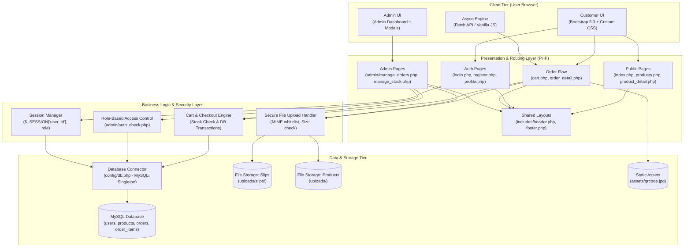
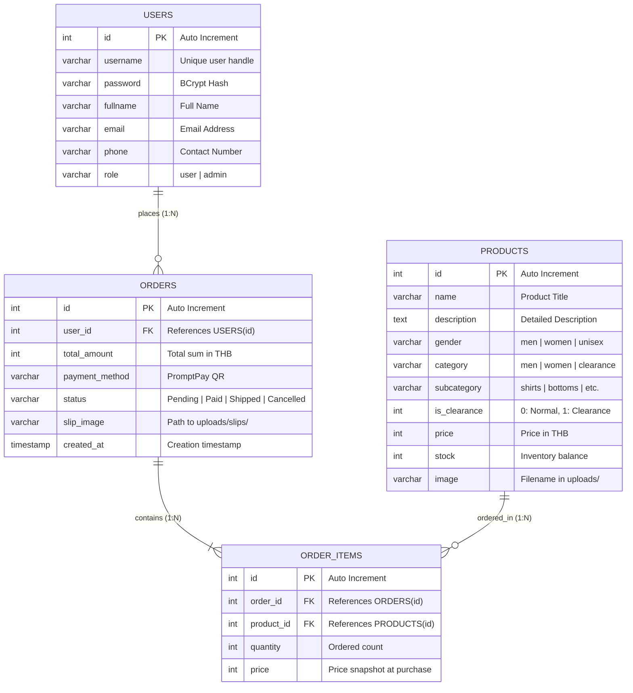
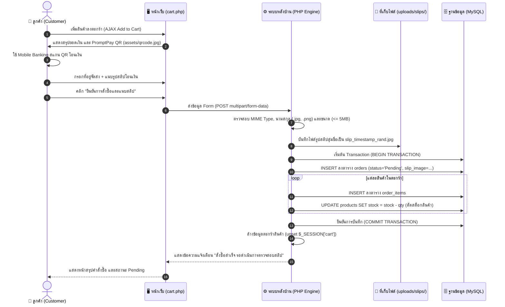
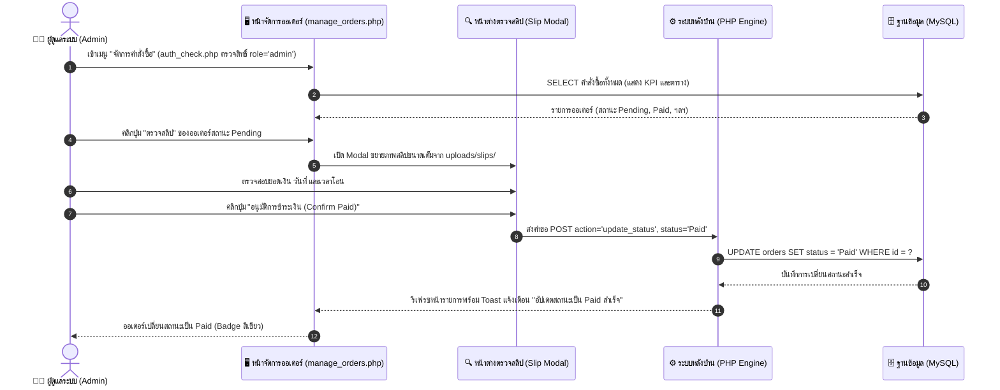
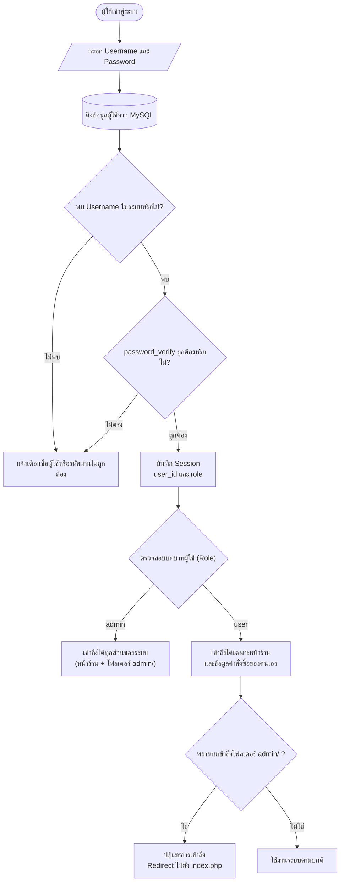

# 🛍️ Clothing Store E-Commerce System (Term Project 2026)

ระบบร้านค้าเสื้อผ้าออนไลน์แบบครบวงจร (Full-Stack E-Commerce Web Application) พัฒนาด้วยภาษา **PHP**, ฐานข้อมูล **MySQL**, สถาปัตยกรรมแบบ Modular Monolithic พร้อมระบบจัดการตะกร้าสินค้าแบบ AJAX, ระบบชำระเงิน **PromptPay QR Code + แนบสลิป**, ระบบหลังบ้านสำหรับผู้ดูแลระบบ (Admin Dashboard) และระบบรักษาความปลอดภัยตามมาตรฐานความปลอดภัยเว็บ

---

## 📑 สารบัญ (Table of Contents)
1. [ภาพรวมของระบบ (Project Overview)](#-ภาพรวมของระบบ-project-overview)
2. [สถาปัตยกรรมระบบ (System Architecture)](#-สถาปัตยกรรมระบบ-system-architecture)
3. [โครงสร้างฐานข้อมูล (Database Schema & ER Diagram)](#-โครงสร้างฐานข้อมูล-database-schema--er-diagram)
4. [ผังการทำงานของระบบ (System Workflows)](#-ผังการทำงานของระบบ-system-workflows)
   - [4.1 ผังการสั่งซื้อและชำระเงิน (Checkout & Slip Upload Flow)](#41-ผังการสั่งซื้อและชำระเงิน-checkout--slip-upload-flow)
   - [4.2 ผังการตรวจสอบและอนุมัติสลิปของแอดมิน (Admin Slip Verification Flow)](#42-ผังการตรวจสอบและอนุมัติสลิปของแอดมิน-admin-slip-verification-flow)
   - [4.3 ผังการยืนยันตัวตนและสิทธิ์การเข้าใช้งาน (Authentication & RBAC Flow)](#43-ผังการยืนยันตัวตนและสิทธิ์การเข้าใช้งาน-authentication--rbac-flow)
5. [โครงสร้างโฟลเดอร์และไฟล์ (Directory Structure)](#-โครงสร้างโฟลเดอร์และไฟล์-directory-structure)
6. [คุณสมบัติเด่นของระบบ (Key Features)](#-คุณสมบัติเด่นของระบบ-key-features)
7. [มาตรฐานความปลอดภัย (Security Implementations)](#-มาตรฐานความปลอดภัย-security-implementations)
8. [คู่มือการติดตั้งและใช้งาน (Installation & Setup)](#-คู่มือการติดตั้งและใช้งาน-installation--setup)

---

## 🌟 ภาพรวมของระบบ (Project Overview)

ระบบถูกออกแบบมาเพื่อรองรับกระบวนการซื้อขายเสื้อผ้าออนไลน์เต็มรูปแบบ โดยแบ่งผู้ใช้งานออกเป็น 2 บทบาทหลัก:
1. **ลูกค้าทั่วไป (Customer / User)**:
   - ค้นหา กรอง และจัดเรียงสินค้าตามราคา ประเภทสินค้า หรือคำค้นหา
   - ดูรายละเอียดเชิงลึกของสินค้า (รูปภาพ, สต็อก, ตารางไซส์, รายละเอียดเนื้อผ้า)
   - สั่งซื้อสินค้าลงตะกร้าแบบ Real-time ด้วย AJAX โดยไม่ต้องโหลดหน้าเว็บใหม่
   - ชำระเงินด้วยวิธี **PromptPay QR Code** พร้อมแนบไฟล์สลิปหลักฐานการโอนเงิน
   - ตรวจสอบประวัติการสั่งซื้อ ติดตามสถานะออเดอร์ และพิมพ์ใบเสร็จ (Print Invoice)
2. **ผู้ดูแลระบบ (Admin)**:
   - แดชบอร์ดสรุปยอดขาย คำสั่งซื้อรอดำเนินการ และสถิติภาพรวม
   - ระบบตรวจสอบสลิปโอนเงิน (Inspect Payment Slip) พร้อมกดอนุมัติสถานะเป็น `Paid`
   - ระบบบริหารจัดการสต็อกสินค้า (เพิ่ม ลบ แก้ไข อัปโหลดรูปภาพสินค้า)

---

## 🏛️ สถาปัตยกรรมระบบ (System Architecture)

ระบบใช้สถาปัตยกรรมแบบ **Layered Modular Architecture** ที่แยกหน้าที่ระหว่างส่วนติดต่อผู้ใช้ (Presentation Layer), ส่วนประมวลผลตรรกะธุรกิจ (Business Logic Layer), และส่วนจัดการข้อมูล (Data & Storage Layer) ไว้อย่างชัดเจน



---

## 🗄️ โครงสร้างฐานข้อมูล (Database Schema & ER Diagram)

ฐานข้อมูลใช้ชื่อ `clothing_store` มีเอนทิตีที่สัมพันธ์กันทั้งหมด 4 ตาราง พร้อมข้อกำหนด Referential Integrity (Foreign Keys แบบ `ON DELETE CASCADE`)



---

## 🔄 ผังการทำงานของระบบ (System Workflows)

### 4.1 ผังการสั่งซื้อและชำระเงิน (Checkout & Slip Upload Flow)
ลูกค้าเลือกสินค้า สแกน QR Code พร้อมเพย์ และแนบสลิปเพื่อส่งคำสั่งซื้อ



---

### 4.2 ผังการตรวจสอบและอนุมัติสลิปของแอดมิน (Admin Slip Verification Flow)
ผู้ดูแลระบบตรวจสอบยอดเงินและเวลาในสลิปผ่าน Modal แล้วอนุมัติสถานะเป็น `Paid`



---

### 4.3 ผังการยืนยันตัวตนและสิทธิ์การเข้าใช้งาน (Authentication & RBAC Flow)



---

## 📂 โครงสร้างโฟลเดอร์และไฟล์ (Directory Structure)

```plaintext
clothing_store/
├── admin/                           # พื้นที่การจัดการสำหรับผู้ดูแลระบบ (Admin Only)
│   ├── auth_check.php               # Middleware ตรวจสอบสิทธิ์ผู้ดูแลระบบ (RBAC Guard)
│   ├── manage_orders.php            # จัดการออเดอร์ ตรวจสอบสลิป และอนุมัติสถานะชำระเงิน
│   └── manage_stock.php             # จัดการสต็อกสินค้า (เพิ่ม ลบ แก้ไข อัปโหลดรูปสินค้า)
├── assets/                          # ไฟล์ทรัพยากรคงที่ของระบบ (Static Assets)
│   └── qrcode.jpg                   # ภาพ QR Code พร้อมเพย์สำหรับรับชำระเงิน
├── config/                          # การตั้งค่าระบบและฐานข้อมูล
│   └── db.php                       # ไฟล์เชื่อมต่อฐานข้อมูล MySQLi แบบรวมศูนย์
├── includes/                        # ชิ้นส่วน UI ส่วนกลาง (Reusable Layout Components)
│   ├── header.php                   # แถบเมนูด้านบน (Navbar), ตะกร้าสินค้า และการเชื่อมโยง CSS
│   └── footer.php                   # ท้ายหน้าเว็บ, Toast Notification UI และ Script JS
├── uploads/                         # โฟลเดอร์เก็บไฟล์สื่อที่อัปโหลดเข้าสู่ระบบ
│   ├── .gitkeep                     # รักษาโครงสร้างไดเรกทอรีใน Git
│   └── slips/                       # โฟลเดอร์เก็บรูปสลิปหลักฐานการโอนเงินของลูกค้า
│       └── .gitkeep
├── index.php                        # หน้าแรกของเว็บไซต์ (Landing Page & Hero Section)
├── products.php                     # หน้ารวมสินค้า พร้อมแถบค้นหา ตัวกรองราคา และการจัดเรียง
├── product_detail.php               # หน้ารายละเอียดสินค้า ไซส์ ตารางขนาด และสินค้าที่เกี่ยวข้อง
├── cart.php                         # ตะกร้าสินค้า, สแกน PromptPay QR และฟอร์มแนบสลิป
├── order_detail.php                 # หน้ารายละเอียดคำสั่งซื้อ และระบบพิมพ์ใบเสร็จ (Print Invoice)
├── login.php                        # หน้าเข้าสู่ระบบ
├── register.php                     # หน้าลงทะเบียนผู้ใช้งานใหม่
├── logout.php                       # หน้าออกจากระบบและทำลาย Session
├── profile.php                      # หน้าโปรไฟล์ผู้ใช้ และประวัติการสั่งซื้อ
├── edit_profile.php                 # หน้าแก้ไขข้อมูลส่วนตัว
├── change_password.php              # หน้าเปลี่ยนรหัสผ่าน
├── forgot_password.php              # หน้าลืมรหัสผ่าน (จำลองการกู้คืนรหัส)
├── ER_DIAGRAM.md                    # เอกสารรายละเอียดโครงสร้างฐานข้อมูล
└── README.md                        # เอกสารอธิบายภาพรวมและสถาปัตยกรรมของโปรเจกต์
```

---

## 💎 คุณสมบัติเด่นของระบบ (Key Features)

| ฟีเจอร์ (Feature) | คำอธิบายการทำงาน (Description) | ไฟล์หลักที่เกี่ยวข้อง |
| :--- | :--- | :--- |
| **PromptPay QR Payment** | รับชำระเงินวิธีเดียวผ่าน PromptPay QR Code พร้อมระบบบังคับอัปโหลดสลิป | [`cart.php`](file:///D:/Xamp/htdocs/clothing_store/cart.php) |
| **Slip Inspection Modal** | แอดมินสามารถเปิดดูรูปสลิปขนาดเต็ม และกดอนุมัติสถานะเป็น `Paid` ได้ในคลิกเดียว | [`admin/manage_orders.php`](file:///D:/Xamp/htdocs/clothing_store/admin/manage_orders.php) |
| **AJAX Add to Cart** | เพิ่มสินค้าลงตะกร้าแบบ Asynchronous พร้อมอัปเดตตัวเลข Badge และ Toast UI | [`cart.php`](file:///D:/Xamp/htdocs/clothing_store/cart.php), [`includes/footer.php`](file:///D:/Xamp/htdocs/clothing_store/includes/footer.php) |
| **Product Detail Page** | หน้าแสดงรายละเอียดสินค้าแบบครบวงจร พร้อมตัวเลือกไซส์ (S, M, L, XL, XXL) | [`product_detail.php`](file:///D:/Xamp/htdocs/clothing_store/product_detail.php) |
| **Search & Advanced Filters** | ค้นหาแบบเรียลไทม์ กรองช่วงราคา (Min-Max) และจัดเรียงสินค้าตามเงื่อนไข | [`products.php`](file:///D:/Xamp/htdocs/clothing_store/products.php) |
| **Printable Invoice** | หน้ารายละเอียดออเดอร์พร้อมปุ่มพิมพ์ใบเสร็จ ปรับแต่ง CSS สำหรับพิมพ์กระดาษ A4 | [`order_detail.php`](file:///D:/Xamp/htdocs/clothing_store/order_detail.php) |
| **Stock Management** | แอดมินสามารถเพิ่ม ลบ แก้ไขสต็อกสินค้า อัปโหลดรูป และแก้ไขรายละเอียด | [`admin/manage_stock.php`](file:///D:/Xamp/htdocs/clothing_store/admin/manage_stock.php) |

---

## 🔒 มาตรฐานความปลอดภัย (Security Implementations)

1. **การป้องกัน SQL Injection**:
   - คำสั่งคิวรีทุกส่วนที่รับค่าจากผู้ใช้ (Input Variables) จะประมวลผลผ่าน **Prepared Statements (`mysqli_stmt`)** ร่วมกับ Parameter Binding เสมอ 100%
2. **การรักษาความปลอดภัยของรหัสผ่าน**:
   - รหัสผ่านผู้ใช้งานถูกเข้ารหัสด้วยอัลกอริทึม **BCrypt** ผ่านฟังก์ชันมาตรฐาน `password_hash($password, PASSWORD_BCRYPT)` และตรวจสอบด้วย `password_verify()`
3. **การควบคุมการเข้าถึงตามบทบาท (Role-Based Access Control - RBAC)**:
   - ไฟล์ในโฟลเดอร์ `admin/` จะต้องเรียกใช้ [`admin/auth_check.php`](file:///D:/Xamp/htdocs/clothing_store/admin/auth_check.php) เพื่อตรวจสอบว่าผู้ใช้ล็อกอินและมีสิทธิ์ `role === 'admin'` หากไม่ใช่จะถูกตัดสิทธิ์ทันที
4. **การตรวจสอบไฟล์อัปโหลดอย่างเข้มงวด (Secure File Upload)**:
   - ตรวจสอบทั้งนามสกุลไฟล์ และตรวจสอบ **MIME Type** จริงของไฟล์รูปภาพ
   - กำหนดขนาดไฟล์สูงสุดไม่เกิน 5MB
   - สุ่มเปลี่ยนชื่อไฟล์ใหม่ตามรูปแบบ Timestamp + Random Hex เพื่อป้องกันการเขียนทับไฟล์และ Path Traversal
5. **ความถูกต้องสมบูรณ์ของข้อมูลธุรกรรม (Transaction Integrity)**:
   - การตัดสต็อกสินค้าและการบันทึกออเดอร์ทำงานภายใต้ **Database Transaction** หากมีขั้นตอนใดล้มเหลว ระบบจะทำการ `rollback()` เพื่อป้องกันข้อมูลผิดพลาด

---

## 🚀 คู่มือการติดตั้งและใช้งาน (Installation & Setup)

### ข้อกำหนดของระบบ (System Requirements)
- เว็บเซิร์ฟเวอร์: **Apache** (เช่น XAMPP, WampServer หรือ Laragon)
- ภาษา: **PHP 8.0 ขึ้นไป** พร้อม Extension `mysqli`, `fileinfo`
- ระบบจัดการฐานข้อมูล: **MySQL 5.7+** หรือ **MariaDB 10.4+**

### ขั้นตอนการติดตั้ง (Setup Steps)

1. **คัดลอกโปรเจกต์ไปยัง Web Root**:
   - ย้ายโฟลเดอร์โปรเจกต์ไปไว้ที่ `D:\Xamp\htdocs\clothing_store` (หรือไดเรกทอรี `htdocs` ของคุณ)

2. **สร้างฐานข้อมูลและตารางข้อมูล**:
   - เปิดโปรแกรม XAMPP Control Panel แล้วกด Start โมดูล **Apache** และ **MySQL**
   - ไปที่ `http://localhost/phpmyadmin`
   - สร้างฐานข้อมูลชื่อ: `clothing_store` กำหนด Collation เป็น `utf8mb4_general_ci`
   - นำเข้า (Import) หรือรันคำสั่ง SQL DDL จากเอกสาร [`ER_DIAGRAM.md`](file:///D:/Xamp/htdocs/clothing_store/ER_DIAGRAM.md)

3. **ตั้งค่าการเชื่อมต่อฐานข้อมูล**:
   - ตรวจสอบไฟล์ [`config/db.php`](file:///D:/Xamp/htdocs/clothing_store/config/db.php) ให้ตรงกับการตั้งค่าของคุณ:
     ```php
     $host = "localhost";
     $user = "root";
     $pass = "";
     $db   = "clothing_store";
     ```

4. **ตรวจสอบสิทธิ์โฟลเดอร์สำหรับเก็บไฟล์**:
   - ตรวจสอบว่ามีโฟลเดอร์ `uploads/` และ `uploads/slips/` อยู่ในโปรเจกต์เพื่อรองรับการอัปโหลดไฟล์รูปภาพ

5. **เข้าใช้งานระบบผ่านเบราว์เซอร์**:
   - หน้าร้านค้า (Customer): `http://localhost/clothing_store/index.php`
   - หน้าจัดการคำสั่งซื้อ (Admin): `http://localhost/clothing_store/admin/manage_orders.php`
   - หน้าจัดการสต็อกสินค้า (Admin): `http://localhost/clothing_store/admin/manage_stock.php`

---


